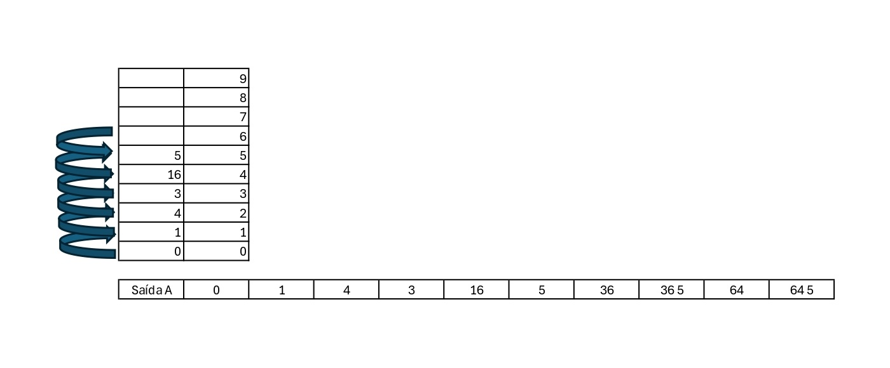
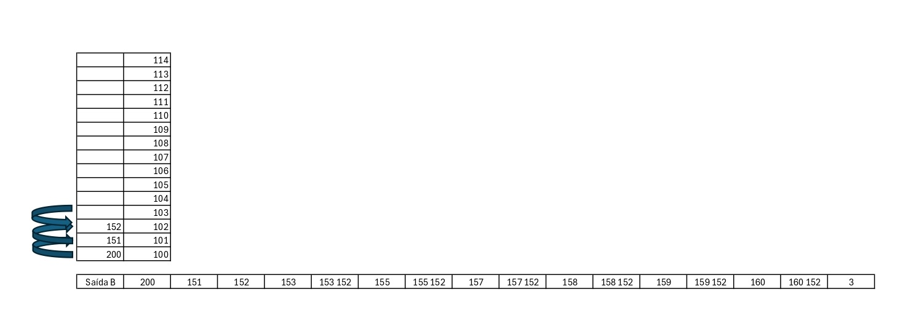

# Atividade - Conversor de decimal para binário.

Conversos de decimal para binário usando conceito de pilha.

**Disciplina :** Estrutura de Dados

- ***Gabriel Ferreira Amorim  - ADS - Fatec Zona Leste / 2025***
